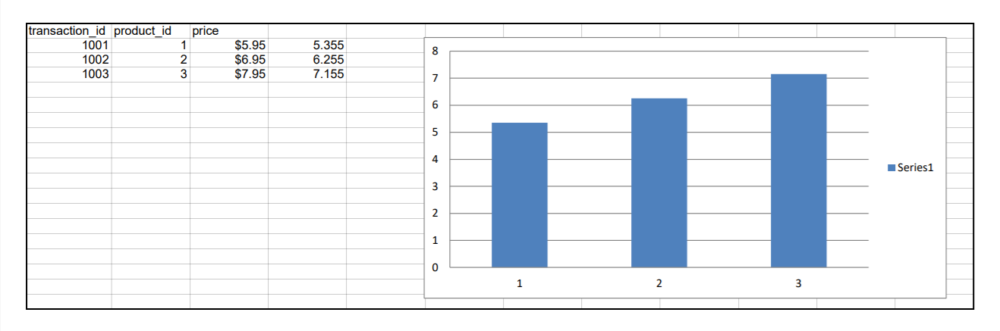

# processSpreadsheet

Performs a basic operation on cell and creates a graph

## Goal 

Checking out openpyxl. 

## Library used
  
  - [Openpyxl](https://pypi.org/project/openpyxl/)

### Screenshot

  
  
